# Pixel Verification Tests

41 tests, 41 mobile baselines (390×844 · 2× dpr · Chromium 140.0.7339.16; `rotate-overlay` is the one landscape capture, 844×390).
Run with `npm run verify` from `harness/`; all must pass at `maxDiffPixels 0` before any frontend change ships.

---

## Static views — `views.spec.js`

Driven by `states.json`. Each navigates to a URL, clicks through steps, and screenshots the settled page.

| # | Screenshot | Checks | Spec |
|---|-----------|--------|------|
| 1 | 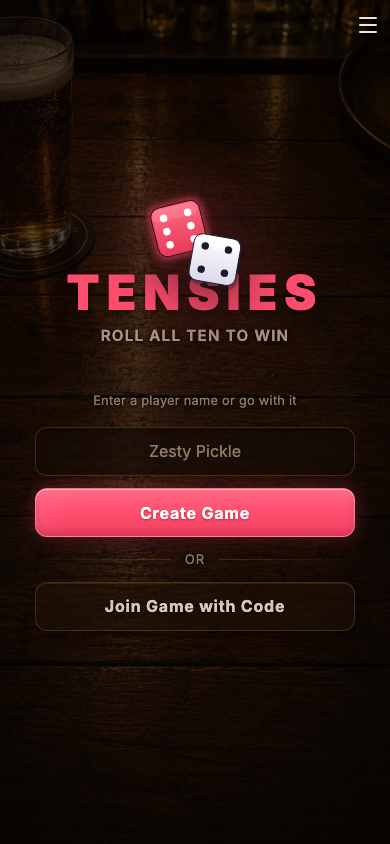 | Landing screen at `/`; name input, Create Game button, Join Game with Code button, hamburger | [views.spec.js:15](harness/views.spec.js#L15) |
| 2 | 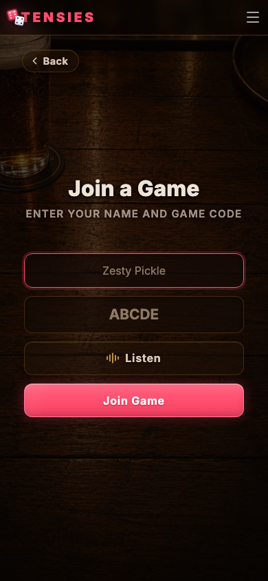 | Join screen after clicking "Join Game with Code"; name input, code input, Listen (audio code) button with equalizer icon, Back chip | [views.spec.js:15](harness/views.spec.js#L15) |
| 3 | 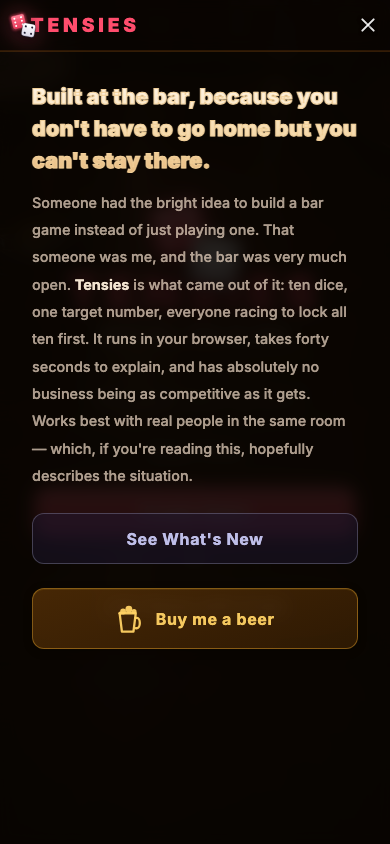 | Nav menu slid down from the hamburger; about blurb and "See What's New" button | [views.spec.js:15](harness/views.spec.js#L15) |

---

## Real-interaction states — `extras.spec.js`

Reached by driving the live app through actual clicks and form submissions.

| # | Screenshot | Checks | Spec |
|---|-----------|--------|------|
| 4 | 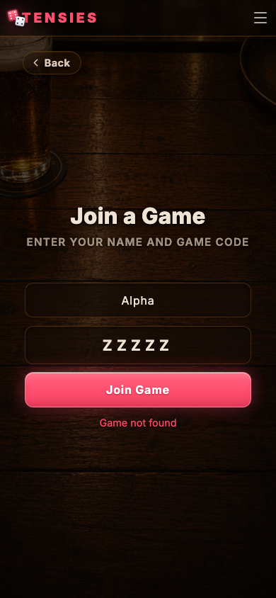 | Join form submitted with a non-existent code (`ZZZZZ`); inline error message visible below the form, Listen button between code input and submit | [extras.spec.js:6](harness/extras.spec.js#L6) |
| 5 | 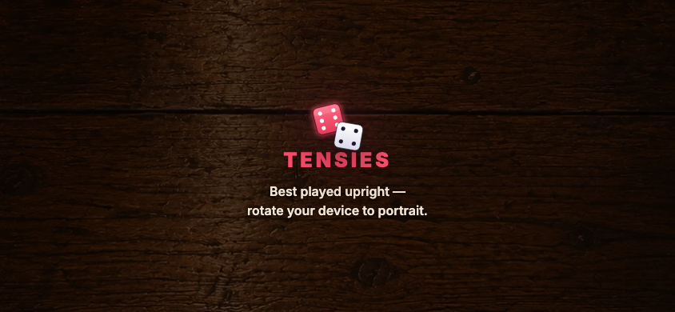 | Phone held sideways (844×390 landscape — the only non-portrait baseline); the CSS orientation guard covers the layout: dice logo-mark, TENSIES wordmark, "rotate your device to portrait" prompt | [extras.spec.js:21](harness/extras.spec.js#L21) |
| 6 | 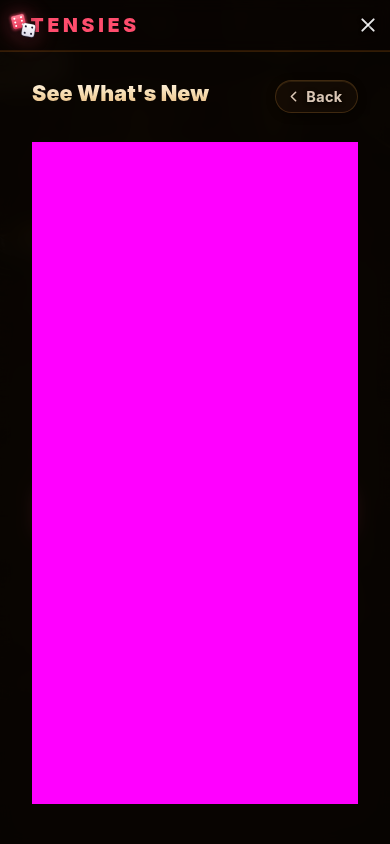 | "What's New" changelog panel open; changelog body masked (content changes) — protects panel chrome: header, Back button, scroll fades | [extras.spec.js:34](harness/extras.spec.js#L34) |

---

## Synthesized server-driven states — `stateful.spec.js`

A single real WebSocket connection; `pinWebSocket` rewrites every inbound `state` frame into the exact roster, dice, and target needed. `seedPage` pins `Math.random` and `Date.now` so dice scatter and countdown timers are byte-stable.

### Lobby

| # | Screenshot | Checks | Spec |
|---|-----------|--------|------|
| 7 | 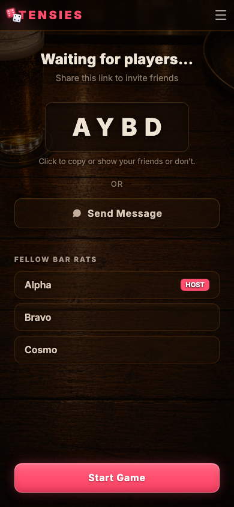 | 3-player lobby, current player is host; player list, game code chip, Start button, Share + Play (audio code) buttons | [stateful.spec.js:44](harness/stateful.spec.js#L44) |
| 8 | 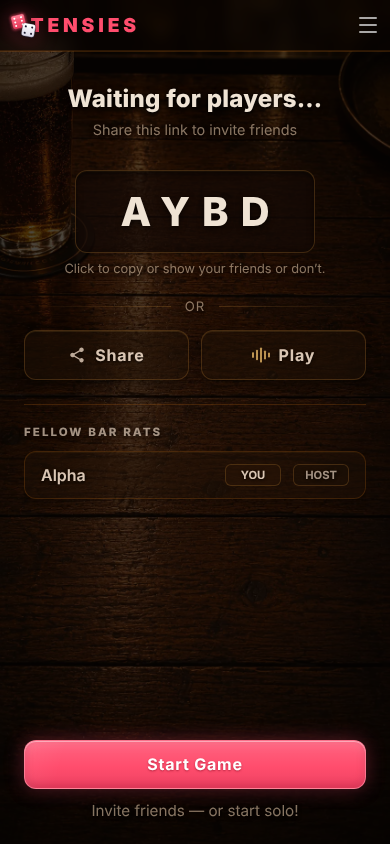 | Lobby with only the host; single-player list, Start button, Share + Play (audio code) buttons | [stateful.spec.js:96](harness/stateful.spec.js#L96) |
| 9 | 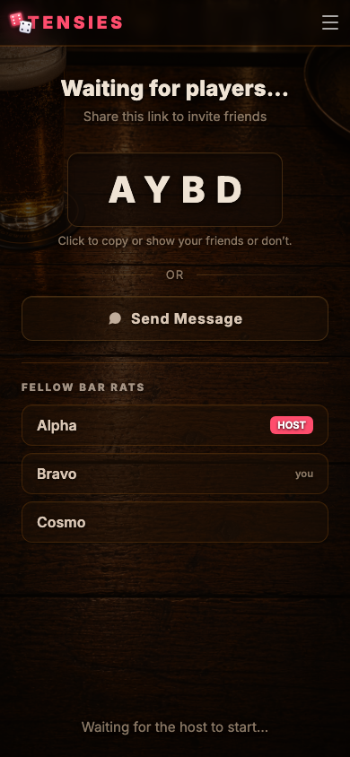 | Lobby as a non-host guest; "You" badge on own row, "Waiting for host" instead of Start button | [stateful.spec.js:105](harness/stateful.spec.js#L105) |
| 10 | 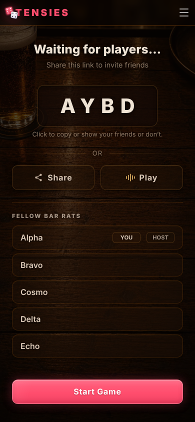 | Lobby at 5 players (max); list overflow and scroll-fade behavior | [stateful.spec.js:117](harness/stateful.spec.js#L117) |

### Game board

| # | Screenshot | Checks | Spec |
|---|-----------|--------|------|
| 11 | 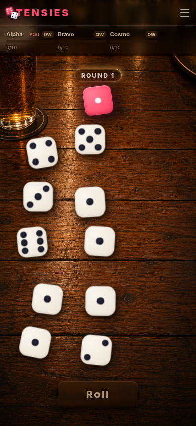 | Started game mid-round, 3 players with mixed locked/unlocked dice; players bar, round target die, roll button | [stateful.spec.js:54](harness/stateful.spec.js#L54) |
| 12 | 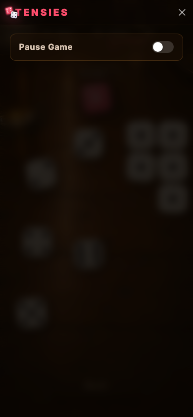 | In-game menu (slides down from the top bar) open over the blurred board; the host's "Pause Game" toggle is its only item | [stateful.spec.js:130](harness/stateful.spec.js#L130) |
| 13 | 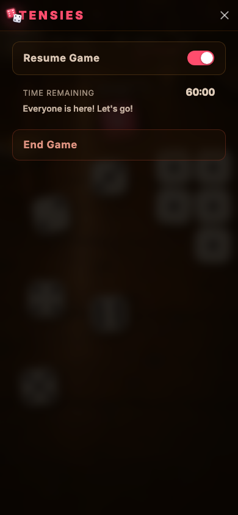 | Paused game as host with menu open; 60:00 countdown, "Everyone is here" count, Resume toggle | [stateful.spec.js:146](harness/stateful.spec.js#L146) |
| 14 |  | Paused game as host, menu closed; board visible, Roll button reads "Paused" | [stateful.spec.js:270](harness/stateful.spec.js#L270) |
| 15 | 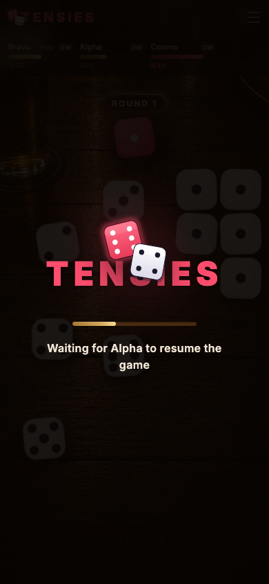 | Paused game as non-host; pause overlay "Waiting for Alpha to resume the game" | [stateful.spec.js:166](harness/stateful.spec.js#L166) |
| 16 | 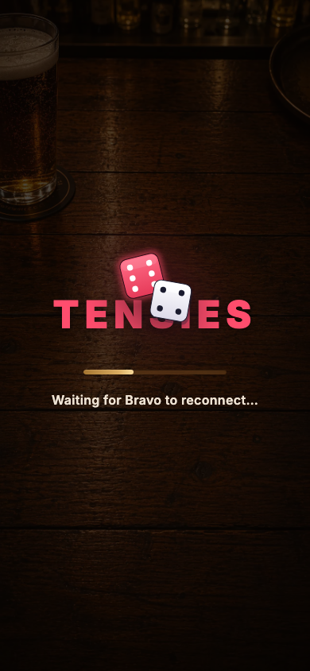 | Peer (Bravo) disconnected mid-game; loading screen with reconnect message | [stateful.spec.js:182](harness/stateful.spec.js#L182) |
| 17 | 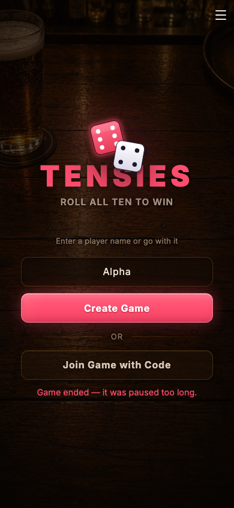 | Terminal error frame received (simulates pause-cap expiry); session cleared, landing returns with error message inline | [stateful.spec.js:200](harness/stateful.spec.js#L200) |

### Round winner

| # | Screenshot | Checks | Spec |
|---|-----------|--------|------|
| 18 | 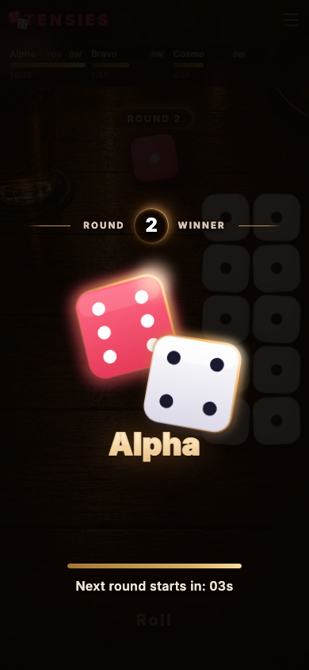 | Round-won overlay when I am the winner; "Winner" banner, my name, countdown timer bar | [stateful.spec.js:68](harness/stateful.spec.js#L68) |
| 19 | 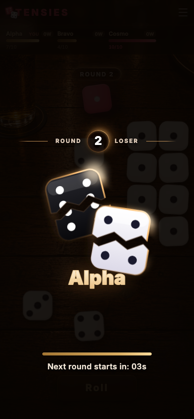 | Round-won overlay when someone else (Cosmo) won; the viewer sees the **"Loser"** banner, the shattered-dice logo, and **their own name** (Alpha) — losers never see the winner's name in the overlay | [stateful.spec.js:82](harness/stateful.spec.js#L82) |

### Players bar variants

| # | Screenshot | Checks | Spec |
|---|-----------|--------|------|
| 20 | 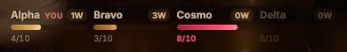 | Bar clipped to show all four card states at once: **is-me**, **leading** (most wins), **hot** (≥7 matched), **disconnected** — needs a paused game so the board stays visible with a disconnected peer | [stateful.spec.js:247](harness/stateful.spec.js#L247) |

### Round target die — each face value

`<round-target>` clipped to the element, independent of board scatter.

| # | Screenshot | Checks | Spec |
|---|-----------|--------|------|
| 21 |  | Target die **1** — one centre pip | [stateful.spec.js:289](harness/stateful.spec.js#L289) |
| 22 |  | Target die **2** — two diagonal pips | [stateful.spec.js:289](harness/stateful.spec.js#L289) |
| 23 |  | Target die **3** — three diagonal pips | [stateful.spec.js:289](harness/stateful.spec.js#L289) |
| 24 |  | Target die **4** — four corner pips | [stateful.spec.js:289](harness/stateful.spec.js#L289) |
| 25 |  | Target die **5** — four corners + centre | [stateful.spec.js:289](harness/stateful.spec.js#L289) |
| 26 |  | Target die **6** — six pips, two columns | [stateful.spec.js:289](harness/stateful.spec.js#L289) |

### Play die — each face value

The regular ivory bone die, clipped to the first unmatched `.die-scene` on the board (all ten of my dice carry the value; the target differs so the cube is non-matched). Each clip pins the face value, the `--die-face` bone material, the drilled `PIP_POSITIONS` pip layout, and the seeded scatter pose.

| # | Screenshot | Checks | Spec |
|---|-----------|--------|------|
| 27 |  | Play die **1** — one centre pip | [stateful.spec.js:308](harness/stateful.spec.js#L308) |
| 28 |  | Play die **2** — two diagonal pips | [stateful.spec.js:308](harness/stateful.spec.js#L308) |
| 29 |  | Play die **3** — three diagonal pips | [stateful.spec.js:308](harness/stateful.spec.js#L308) |
| 30 |  | Play die **4** — four corner pips | [stateful.spec.js:308](harness/stateful.spec.js#L308) |
| 31 |  | Play die **5** — four corners + centre | [stateful.spec.js:308](harness/stateful.spec.js#L308) |
| 32 |  | Play die **6** — six pips, two columns | [stateful.spec.js:308](harness/stateful.spec.js#L308) |

---

## Auth-dependent states — `auth.spec.js`

States that require a fake JWT in `localStorage` before page load (so `refreshAuth()` / `getAuthUser()` see the signed-in state on first render). Server-driven views (game board) additionally intercept the outbound `auth` WS action and return a synthetic `auth_ok` — the fake JWT has a bogus signature the server would reject.

| # | Screenshot | Checks | Spec |
|---|-----------|--------|------|
| 33 | 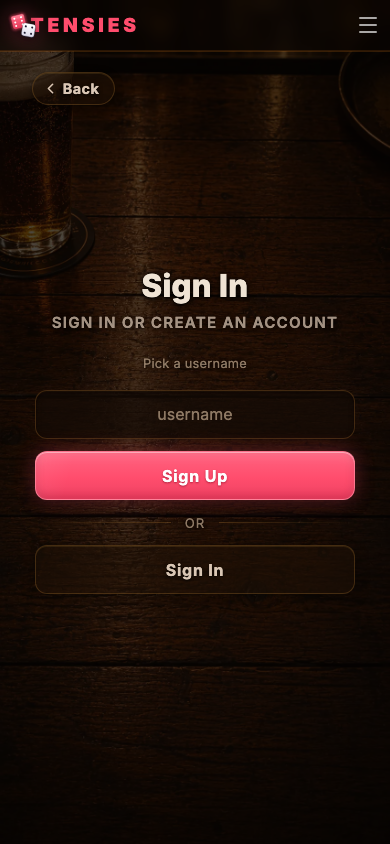 | Sign-in/sign-up screen reached via nav menu `.menu-auth-btn`; no JWT needed | [auth.spec.js:26](harness/auth.spec.js#L26) |
| 34 | 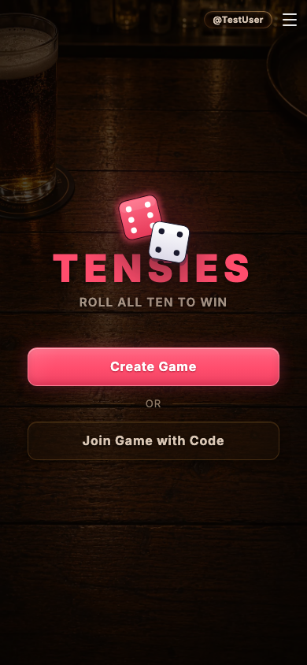 | Landing with JWT injected; name input hidden, label hidden, `@TestUser` pill in header | [auth.spec.js:39](harness/auth.spec.js#L39) |
| 35 | 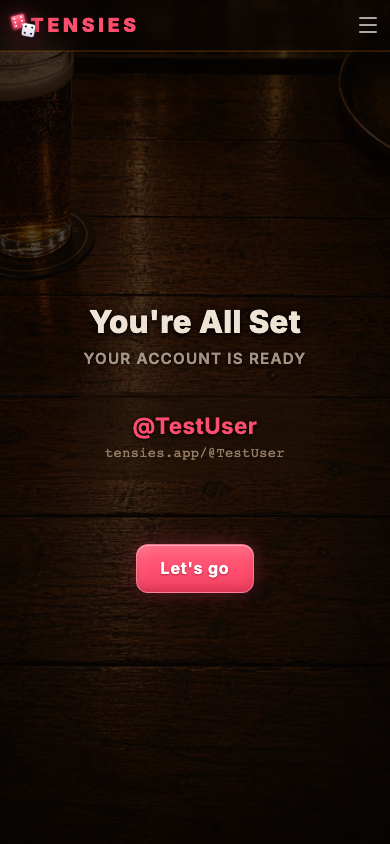 | Post-signup welcome screen; JWT + `sessionStorage('tensies_onboarding')` seeded, navigated to `/welcome`; `@TestUser` username and vanity URL | [auth.spec.js:51](harness/auth.spec.js#L51) |
| 36 | 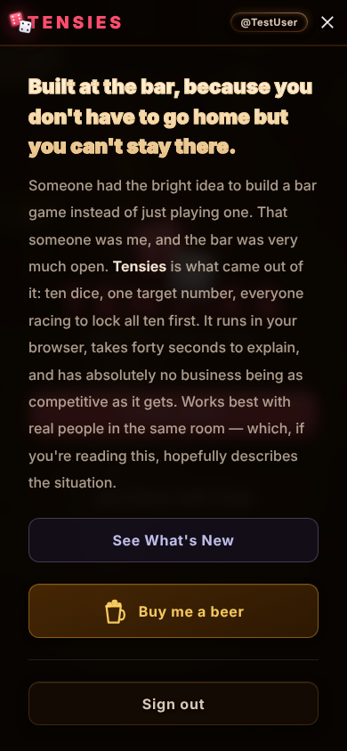 | Nav menu when signed in; shows "Sign out" instead of "Sign in or Sign up" | [auth.spec.js:67](harness/auth.spec.js#L67) |
| 37 | 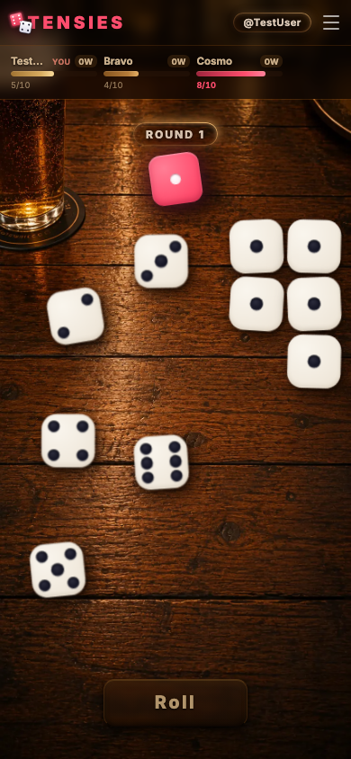 | Game board with JWT + WS auth intercept; `@TestUser` pill visible next to hamburger, same dice layout as signed-out for diffing | [auth.spec.js:143](harness/auth.spec.js#L143) |
| 38 | 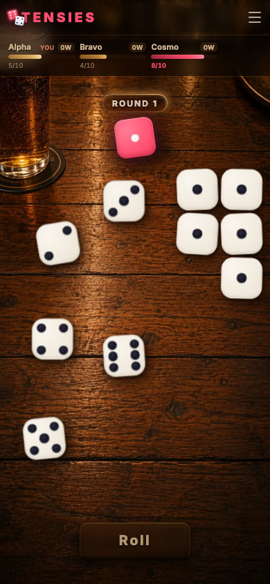 | Game board without JWT; no pill, same dice layout as signed-in companion | [auth.spec.js:154](harness/auth.spec.js#L154) |

### Profile

Profile pages use `page.route()` to intercept the `/api/profile/*` fetch with deterministic JSON, so baselines are stable without a live database user.

| # | Screenshot | Checks | Spec |
|---|-----------|--------|------|
| 39 |  | Profile with stats; avatar ring with default silhouette, gold gradient username, member-since date, 6 stat cards (Games, Wins, Rounds, Rolls, Best Win, Time Played) | [auth.spec.js:195](harness/auth.spec.js#L195) |
| 40 | 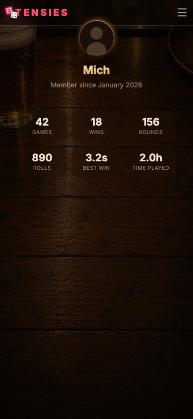 | Profile with `profile_photo_url` set; same layout as above but avatar src swapped to the photo URL | [auth.spec.js:206](harness/auth.spec.js#L206) |
| 41 | 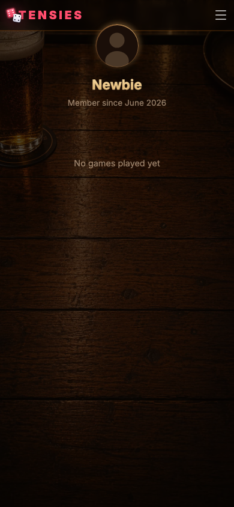 | Profile with `stats: null`; avatar, username, member-since, "No games played yet" empty state | [auth.spec.js:219](harness/auth.spec.js#L219) |
