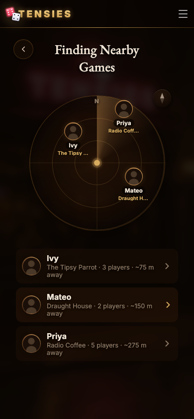
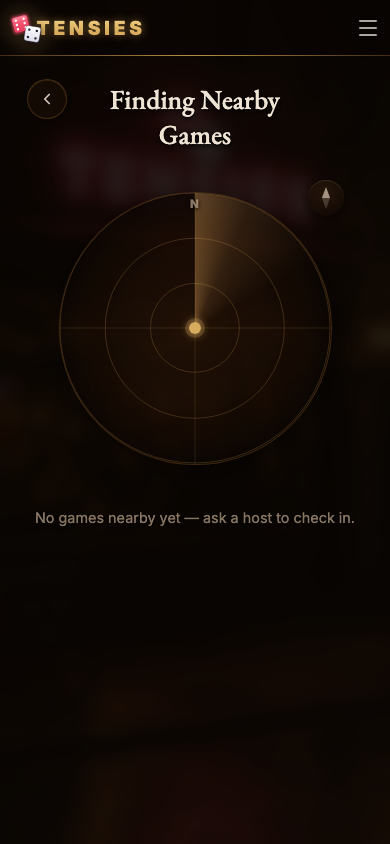
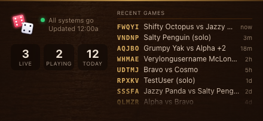
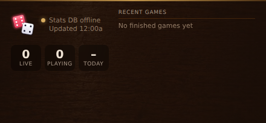
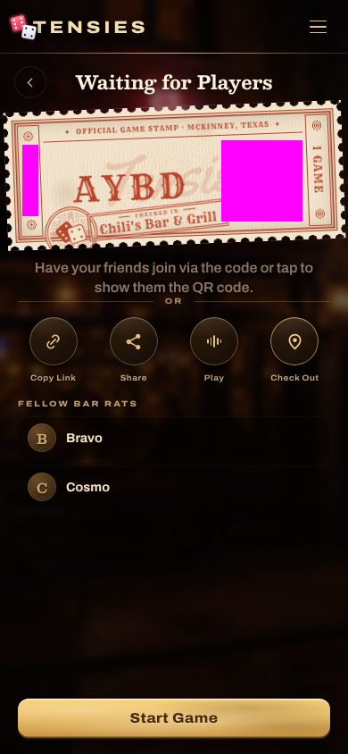

# Pixel Verification Tests

54 tests, 54 mobile baselines (390×844 · 2× dpr · Chromium 149.0.7827.55; `rotate-overlay` is the one landscape capture, 844×390; the two `widget-*` captures are the standalone `/api/widget` card, element-clipped at 440×203).
Run with `npm run verify` from `harness/`; all must pass at `maxDiffPixels 0` before any frontend change ships.

The landing/intro background videos (`feature/video-intro`) are frozen to a fixed frame at capture time — `settle()` in `determinism.js` pauses every `<video>` and pins `currentTime` to its midpoint — so the looping playback doesn't defeat the two-stable-consecutive-screenshots check.

**Volatile content is masked** (the `nav-menu-changelog` pattern): the landing's timer-scrambled join-code (`.join-code`) and the lobby stamp's invite QR (`.qr-box`, which encodes a server-random game code) are excluded from the comparison via `toHaveScreenshot({ mask: [...] })`. The scrambler also runs on its own decorative PRNG so it never advances the shared `Math.random` sequence the harness pins for the seeded name + dice scatter (see `landing-screen.js` / `state.js`).

---

## Static views — `views.spec.js`

Driven by `states.json`. Each navigates to a URL, clicks through steps, and screenshots the settled page.

| # | Screenshot | Checks | Spec |
|---|-----------|--------|------|
| 1 |  | Landing at `/`; time-of-day greeting, name input, gold **Create Game** button, and the **Join with Code** / **Find Nearby Games** action row, over the (frozen) neon bar-sign background. The scrambling join-code is masked | [views.spec.js:16](harness/views.spec.js#L16) |
| 2 |  | **Join** bottom sheet (modal `<dialog>`) opened from the landing's "Join with Code" button; name input, code input, Listen (audio code) button with equalizer icon, over the dimmed landing | [views.spec.js:16](harness/views.spec.js#L16) |
| 3 |  | Nav menu faded in from the hamburger; about blurb and "See What's New" button | [views.spec.js:16](harness/views.spec.js#L16) |

---

## Nearby-games radar — `nearby.spec.js`

Reached from the landing's "Find Nearby Games" button. Deterministic via a faked geolocation fix (overridden `navigator.geolocation`) plus a stubbed `GET /api/nearby` payload (fixed hosts, bucketed distances, bearings) — no live GPS or discovery backend needed.

| # | Screenshot | Checks | Spec |
|---|-----------|--------|------|
| 50 |  | Radar populated with 3 discovered games; blips placed by true bearing + distance, "Finding Nearby Games" title, compass button, and the list below (host · venue · players · distance) | [nearby.spec.js:32](harness/nearby.spec.js#L32) |
| 51 |  | Radar with no games nearby; empty scope with the "you" dot and the "No games nearby yet — ask a host to check in" message | [nearby.spec.js:50](harness/nearby.spec.js#L50) |

---

## Real-interaction states — `extras.spec.js`

Reached by driving the live app through actual clicks and form submissions.

| # | Screenshot | Checks | Spec |
|---|-----------|--------|------|
| 4 |  | **Join sheet** submitted with a non-existent code (`ZZZZZ`); the sheet reopens with the inline error below the form, Listen button between code input and submit | [extras.spec.js:6](harness/extras.spec.js#L6) |
| 5 |  | Phone held sideways (844×390 landscape — the only non-portrait baseline); the CSS orientation guard covers the layout: dice logo-mark + "rotate your device to portrait" prompt (the red wordmark was removed) | [extras.spec.js:22](harness/extras.spec.js#L22) |
| 6 |  | **What's New** changelog as its own routed screen at `/changelog` (Brass & Enamel gave it its own door — it is no longer a slide-over state on the nav-menu panel); changelog body masked (the prose is regenerated), which is what protects the chrome: app header, back chip, title | [extras.spec.js:35](harness/extras.spec.js#L35) |

---

## Add-to-Home-Screen — `a2hs.spec.js`

The install banner + iOS walkthrough. The `?a2hs=ios` localhost dev override forces the iOS flow under the harness UA; `Date` is fully pinned so the mock status-bar clock is byte-stable. Each step click stops the auto-advance and pins that scene.

| # | Screenshot | Checks | Spec |
|---|-----------|--------|------|
| 45 |  | Landing with the "Add to Home Screen" banner docked at the top; "Faster launch, full screen & more", Add button, dismiss × — over the (frozen) landing video background | [a2hs.spec.js:25](harness/a2hs.spec.js#L25) |
| 46 |  | iOS install walkthrough, step 1 phone scene; step dots, Back chip | [a2hs.spec.js:41](harness/a2hs.spec.js#L41) |
| 47 |  | Walkthrough step 2 phone scene | [a2hs.spec.js:41](harness/a2hs.spec.js#L41) |
| 48 |  | Walkthrough step 3 phone scene | [a2hs.spec.js:41](harness/a2hs.spec.js#L41) |
| 49 |  | Walkthrough step 4 phone scene | [a2hs.spec.js:41](harness/a2hs.spec.js#L41) |

---

## Home-screen widget — `widget.spec.js`

The standalone `/api/widget` card (a wide phone web-widget, ~440×203) — the one
SERVER-rendered page, not the SPA. The `/api/widget` response is stubbed with the
**real** `static/html/widget.html` template substituted with deterministic data,
so the actual `widget.css` / `widget.js` / logo load as real `/static` sub-resources
and stay under pixel test; only the backend data is synthetic (same route-stub idea
as the profile / game-detail states). `Date` is fully pinned (not just `Date.now`)
so `widget.js`'s `new Date()` "Updated 12:00a" render stamp is byte-stable. Captured
at a bespoke 440-wide viewport, element-clipped to `.card`.

| # | Screenshot | Checks | Spec |
|---|-----------|--------|------|
| 53 |  | Healthy widget: dice logo, green "All systems go" dot + "Updated 12:00a", live/playing/today stat boxes (3/2/12), and the Recent Games list over the wood poster — every `_matchup` shape (vs / solo / +N), a long name pair truncated with an ellipsis, all `_ago` buckets (now/m/h/d), and the bottom fade mask on the overflowing list | [widget.spec.js:92](harness/widget.spec.js#L92) |
| 54 |  | Degraded widget: amber "warn" dot + "Stats DB offline", zeroed live/playing counts and "–" today, and the "No finished games yet" empty games row | [widget.spec.js:105](harness/widget.spec.js#L105) |

---

## Synthesized server-driven states — `stateful.spec.js`

A single real WebSocket connection; `pinWebSocket` rewrites every inbound `state` frame into the exact roster, dice, and target needed. `seedPage` pins `Math.random` and `Date.now` so dice scatter and countdown timers are byte-stable. The five lobby captures mask the invite QR (`.qr-box`) — it encodes the real, server-random game code — and the stamp's postmark date (`.stamp-date`), which is the real current day (`new Date()`, not pinned) and so drifts daily.

### Lobby

| # | Screenshot | Checks | Spec |
|---|-----------|--------|------|
| 7 |  | 3-player lobby, current player is host; player list, game code chip, Start button, Share + Play (audio code) buttons | [stateful.spec.js:44](harness/stateful.spec.js#L44) |
| 8 |  | Lobby with only the host; single-player list, Start button, Share + Play (audio code) buttons | [stateful.spec.js:98](harness/stateful.spec.js#L98) |
| 9 |  | Lobby as a non-host guest; "Waiting for host to start…" title with no Start button; the Fellow Bar Rats list (others only, own row excluded) shows the host with a plain gold **HOST** label (no pill) | [stateful.spec.js:107](harness/stateful.spec.js#L107) |
| 10 |  | Lobby at 5 players (max); list overflow and scroll-fade behavior | [stateful.spec.js:119](harness/stateful.spec.js#L119) |
| 52 |  | Checked-in lobby: the stamp wears the check-in cachet (**CHECKED IN** over the venue name, tilted, double ink rule, transparent interior); a long venue name truncates with an ellipsis; the host's Check In button reads **Check Out** | [stateful.spec.js:132](harness/stateful.spec.js#L132) |

### Game board

| # | Screenshot | Checks | Spec |
|---|-----------|--------|------|
| 11 |  | Started game mid-round, 3 players with mixed locked/unlocked dice; players bar, round target die, roll button | [stateful.spec.js:56](harness/stateful.spec.js#L56) |
| 12 |  | In-game menu (slides down from the top bar) open over the blurred board; Pause Game toggle and End Game button | [stateful.spec.js:144](harness/stateful.spec.js#L144) |
| 13 |  | Paused game as host with menu open; 60:00 countdown, "Everyone is here" count, Resume toggle | [stateful.spec.js:160](harness/stateful.spec.js#L160) |
| 14 |  | Paused game as host, menu closed; board visible, Roll button reads "Paused" | [stateful.spec.js:375](harness/stateful.spec.js#L375) |
| 15 |  | Paused game as non-host; pause overlay with the TENSIES wordmark, animated dice loader (replaced the progress bar; the static logo mark was removed), and "Waiting for Alpha to resume the game" | [stateful.spec.js:180](harness/stateful.spec.js#L180) |
| 16 |  | Peer (Bravo) disconnected mid-game; loading screen with the animated dice loader (pink 6 + ivory 4, replaced the old progress bar) and reconnect message | [stateful.spec.js:196](harness/stateful.spec.js#L196) |
| 17 |  | Game ended by host mid-round; redirects to game-detail screen with one-shot "Game ended" label, player list, stats, and Roll Trust verification | [stateful.spec.js:214](harness/stateful.spec.js#L214) |
| 18 |  | Terminal error frame received (simulates pause-cap expiry); session cleared, landing returns with error message inline (the landing's scrambling join-code is masked) | [stateful.spec.js:304](harness/stateful.spec.js#L304) |

### Round winner

| # | Screenshot | Checks | Spec |
|---|-----------|--------|------|
| 19 |  | Round-won overlay when I am the winner; "Winner" banner, my name, countdown timer bar | [stateful.spec.js:70](harness/stateful.spec.js#L70) |
| 20 |  | Round-won overlay when someone else (Cosmo) won; the viewer sees the **"Loser"** banner, the shattered-dice logo, and **their own name** (Alpha) — losers never see the winner's name in the overlay | [stateful.spec.js:84](harness/stateful.spec.js#L84) |

### Players bar variants

| # | Screenshot | Checks | Spec |
|---|-----------|--------|------|
| 21 |  | Bar clipped to show all four card states at once: **is-me**, **leading** (most wins), **hot** (≥7 matched), **disconnected** — needs a paused game so the board stays visible with a disconnected peer | [stateful.spec.js:352](harness/stateful.spec.js#L352) |

---

## Auth-dependent states — `auth.spec.js`

States that require a fake JWT in `localStorage` before page load (so `refreshAuth()` / `getAuthUser()` see the signed-in state on first render). Server-driven views (game board) additionally intercept the outbound `auth` WS action and return a synthetic `auth_ok` — the fake JWT has a bogus signature the server would reject.

| # | Screenshot | Checks | Spec |
|---|-----------|--------|------|
| 34 |  | Sign-in/sign-up screen reached via nav menu `.menu-auth-btn`; no JWT needed. Gold-glow default avatar above the title; single "Sign In / Sign Up" button does double duty (signs in if the account exists, else registers) | [auth.spec.js:42](harness/auth.spec.js#L42) |
| 35 |  | Landing with JWT injected; name input hidden, hint label hidden, name-personalized greeting ("Welcome back, TestUser."), `@TestUser` pill in header, and a restored gap above **Create Game** (since the hidden name field would otherwise crowd it) | [auth.spec.js:58](harness/auth.spec.js#L58) |
| 36 |  | Post-signup welcome screen; JWT + `sessionStorage('tensies_onboarding')` seeded, navigated to `/welcome`; `@TestUser` username and vanity URL | [auth.spec.js:73](harness/auth.spec.js#L73) |
| 37 |  | Nav menu when signed in; the tab line *is* the account control — monogram coin, `@TestUser`, and cached stats ("0 games · 0 rounds won", from the stubbed profile) — and it routes to the profile rather than to sign-in. The **Sign out** button un-hides below the about copy, off-screen at this viewport | [auth.spec.js:89](harness/auth.spec.js#L89) |
| 38 |  | Game board with JWT + WS auth intercept; the board carries the **bare account mark** next to the hamburger and never the `@handle` pill — the players bar already names you (`account-sync.js: syncAccountMark`). Same dice layout as signed-out for diffing | [auth.spec.js:165](harness/auth.spec.js#L165) |
| 39 |  | Game board without JWT; no pill, same dice layout as signed-in companion | [auth.spec.js:368](harness/auth.spec.js#L368) |

### Profile

Profile pages use `page.route()` to intercept the `/api/profile/*` fetch with deterministic JSON, so baselines are stable without a live database user.

| # | Screenshot | Checks | Spec |
|---|-----------|--------|------|
| 40 |  | Profile with stats + recent games; 8 stat cards (Games, Wins, Win Rate, Rounds, Rolls, Best Time, Best Rolls, Time Played), recent multiplayer games with winner/loser avatars, gold/muted scores, per-game stats. `founding_member: true` → gold-gradient "★★★ Founding · avatar · Roller ★★★" designation flanking the avatar | [auth.spec.js:231](harness/auth.spec.js#L231) |
| 41 |  | Profile with `profile_photo_url` set + recent games; same layout as above (incl. the Founding Roller designation) but avatar src swapped to the photo URL | [auth.spec.js:246](harness/auth.spec.js#L246) |
| 42 |  | Profile with `stats: null`; avatar, username, member-since, "No games played yet" empty state. `founding_member: false` → the non-founding control (no designation; avatar sits alone) | [auth.spec.js:262](harness/auth.spec.js#L262) |

### Game detail

Game detail pages use `page.route()` to intercept `/api/game/*` and `/api/game/*/verify` fetches with deterministic JSON. The verification animation runs through its JS-driven phases (setTimeout-based, not CSS) before the final state is captured.

| # | Screenshot | Checks | Spec |
|---|-----------|--------|------|
| 43 |  | Game detail with all 95 rolls verified via drand beacons; game code, play time, duration, player list with wins, Roll Trust shield badge, green checkmarks per player, "All 95 rolls verified" verdict, drand attribution | [auth.spec.js:336](harness/auth.spec.js#L336) |
| 44 |  | Game detail for a pre-drand game with no beacon data; same layout but "No beacon data for this game" verdict instead of checkmarks, no per-player rows | [auth.spec.js:352](harness/auth.spec.js#L352) |

---

## Element clips — `stateful.spec.js`

### Round target die — each face value

`<round-target>` clipped to the element, independent of board scatter.

| # | Screenshot | Checks | Spec |
|---|-----------|--------|------|
| 22 |  | Target die **1** — one centre pip | [stateful.spec.js:395](harness/stateful.spec.js#L395) |
| 23 |  | Target die **2** — two diagonal pips | [stateful.spec.js:395](harness/stateful.spec.js#L395) |
| 24 |  | Target die **3** — three diagonal pips | [stateful.spec.js:395](harness/stateful.spec.js#L395) |
| 25 |  | Target die **4** — four corner pips | [stateful.spec.js:395](harness/stateful.spec.js#L395) |
| 26 |  | Target die **5** — four corners + centre | [stateful.spec.js:395](harness/stateful.spec.js#L395) |
| 27 |  | Target die **6** — six pips, two columns | [stateful.spec.js:395](harness/stateful.spec.js#L395) |

### Play die — each face value

The regular ivory bone die, clipped to the first unmatched `.die-scene` on the board (all ten of my dice carry the value; the target differs so the cube is non-matched). Each clip pins the face value, the `--die-face` bone material, the drilled `PIP_POSITIONS` pip layout, and the seeded scatter pose.

| # | Screenshot | Checks | Spec |
|---|-----------|--------|------|
| 28 |  | Play die **1** — one centre pip | [stateful.spec.js:414](harness/stateful.spec.js#L414) |
| 29 |  | Play die **2** — two diagonal pips | [stateful.spec.js:414](harness/stateful.spec.js#L414) |
| 30 |  | Play die **3** — three diagonal pips | [stateful.spec.js:414](harness/stateful.spec.js#L414) |
| 31 |  | Play die **4** — four corner pips | [stateful.spec.js:414](harness/stateful.spec.js#L414) |
| 32 |  | Play die **5** — four corners + centre | [stateful.spec.js:414](harness/stateful.spec.js#L414) |
| 33 |  | Play die **6** — six pips, two columns | [stateful.spec.js:414](harness/stateful.spec.js#L414) |
