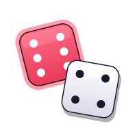
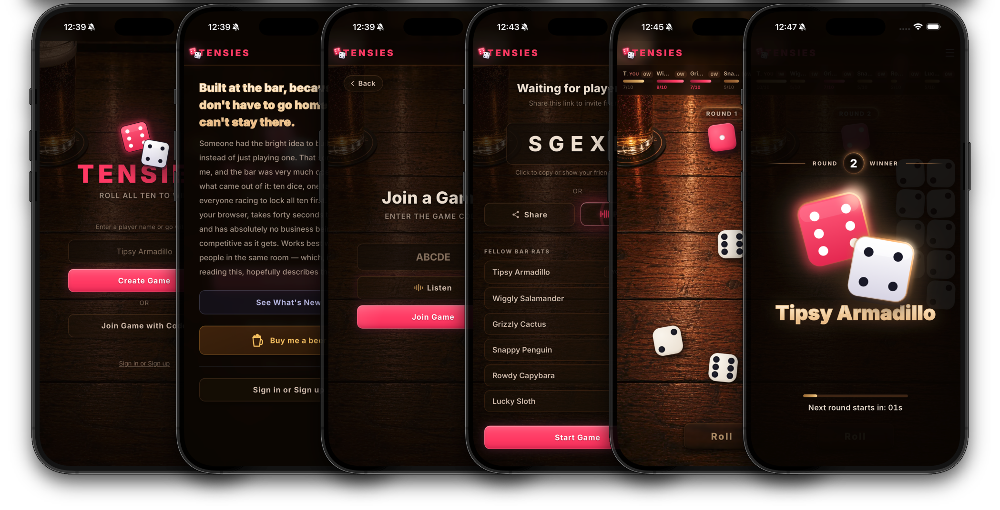

# Tensies

<p align="center">
  
</p>

A real-time multiplayer dice game for the bar, the beach, or anywhere you forgot to bring actual dice.

<p align="center">
  <a href="https://github.com/radiantnode/tensies/actions/workflows/ci.yml"></a>
  <a href="https://github.com/radiantnode/tensies/actions/workflows/codeql.yml"></a>
</p>

---

## The origin story

There's a dice game called Tensies. You roll ten dice, lock the ones that match the target number, keep rolling until all ten match, first one to do it wins the round. Simple, fast, and very good at ruining friendships.

My friends and I played it most weekends. One night, a few heated rounds in and a few drinks down, I decided it would be great to play anywhere, including nights when nobody remembered to bring the dice. So I started building it. Sketched the first board myself, then kept tinkering from my barstool between rounds, with [Claude](https://claude.ai) doing most of the heavy lifting on the code.

Version 1.0 shipped on a Monday. I built the multi-instance rewrite (the one that lets a whole crowd pile in across a row of servers) from a beach chair in Cap Cana, Dominican Republic, dodging back to the pool between edits.

This is not serious software. It's a hobby project that got a little out of hand in the best way.

&nbsp;

<p align="center">
  
</p>

---

## How to play

- One person creates a game and shares the code (or just texts the link).
- Up to five players join. The host hits **Start**.
- A target number appears. Everybody rolls their ten dice at once.
- Dice that match the target lock automatically. Keep rolling the rest.
- First player to lock all ten wins the round.
- Targets count up: 1, 2, 3, 4, 5, 6, then back around.
- Most round wins by the time everyone's ready to close out wins the night.

---

## Features

The dice physics feel right. They gather, shake, scatter across a virtual bar top, and settle. Matched dice slide over and lock. The reveal animation waits for each roller before broadcasting the new state, so nobody sees your result before you do.

Everything else:

- Live multiplayer over WebSocket. Updates in under a second.
- Reconnect grace period: 30 seconds normally, an hour if the game is paused. Phone goes dark mid-round, you get your seat back.
- Host pause, for a bar run, a bathroom break, or figuring out who's buying the next round. Hangs for up to an hour.
- If the host vanishes, the next person in the room quietly takes over. Nobody waits.
- Share by link, SMS, or [audio](docs/audio-sharing/README.md) from the lobby. One phone chirps the code, the other listens and fills it in.
- Dice positions stay put across refreshes.
- Scales horizontally: game state lives in Redis, so you can run as many server instances as you want behind a plain round-robin load balancer. Any instance can serve any game.

---

## Stack

### Server

Python + [FastAPI](https://fastapi.tiangolo.com/) for the async WebSocket server, with a thin REST layer for static assets, metrics, and admin stats.

[Redis](https://redis.io/) is where game state lives. Cross-instance fan-out runs over pub/sub. All player data is a Redis hash, so rolling is parallel: distinct players write distinct fields. The one contested write (crowning a round winner) is an atomic Lua compare-and-set.

[Uvicorn](https://www.uvicorn.org/) is the ASGI server, with `--workers` in prod and `--reload` in dev. [asyncpg](https://github.com/MagicStack/asyncpg) + [Postgres](https://www.postgresql.org/) handle the telemetry event log and rollup tables; those writes are async and stay off the hot path.

[Prometheus](https://prometheus.io/) runs in-process tracking active games, players, roll latency, and WS frame counts. [Grafana](https://grafana.com/) provisions five dashboards automatically from `ops/grafana/dashboards/`; one uses Grafana Live for sub-second push updates. [nginx](https://nginx.org/) sits in front of the web instances in prod as the load balancer.

### Client

Vanilla JavaScript split by concern across `static/js/`, loaded as ES modules with no framework. In dev it loads straight from the browser with no build step; cache-busting is a content hash appended at server startup. In prod an esbuild pipeline bundles and minifies everything into a single JS file and a single CSS file, fingerprints all assets, and pre-compresses them for nginx: 39 requests down to 7, 132 KB of JS+CSS+HTML down to 21 KB on the wire. Details in [`docs/ASSET_PIPELINE.md`](docs/ASSET_PIPELINE.md).

The dice are pure CSS 3D transforms on `.die-3d` faces. The bar-top background is a photo.

### Infrastructure

[Docker + Docker Compose](https://docs.docker.com/compose/) for everything. `docker-compose.yml` is local dev: bind mount, hot reload, relaxed auth. `docker-compose.prod.yml` is production: pinned digest images, non-root user, internal networking, bearer-gated endpoints.

[Playwright](https://playwright.dev/) handles integration testing via Claude Code's MCP server. It covers full two-player games, reconnect, pause, host handoff, and animation timing.

### Built with

I built this with [Claude Code](https://claude.ai/code), Anthropic's CLI for Claude. Claude wrote most of the code. The game design, visual direction, and "that doesn't feel right" instincts were mine. Claude also wrote this README, which is exactly the kind of thing it would do.

---

## Running it

```bash
# Clone
git clone --recurse-submodules <repo-url>
cd tensies

# Dev (starts web + Redis + telemetry stack)
docker compose up -d
open http://localhost:8888
```

The volume mount means edits take effect immediately. You only need to rebuild if `requirements.txt` changes. Telemetry (Postgres + Grafana) is optional: `TELEMETRY_ENABLED=0` skips it for a lightweight run.

```bash
# Production (multi-instance, 3 servers)
docker compose -f docker-compose.prod.yml --env-file .env.prod up -d --scale web=3
```

See `.env.prod.example` for the full env var list. The ones that matter most: `REDIS_URL`, `ALLOWED_ORIGINS`, `METRICS_TOKEN`, `MAX_GAMES`, and the rate limits.

---

## Architecture in brief

Game state lives in Redis so any instance can serve any game. Per-process state is strictly what can't be serialized: open WebSocket handles, live `asyncio` objects. A periodic reaper process is the backstop for grace-drops and pause timeouts whose owning instance might have died.

The roll animation is the most choreographed part. When you roll, the server sends your result back to you first, waits for your `roll_done` ack (or a timeout), then broadcasts to everyone else. Other players never see your dice change before your animation finishes.

Full architecture notes, the WebSocket message protocol, and the telemetry reference are in [`CLAUDE.md`](CLAUDE.md) and [`docs/TELEMETRY.md`](docs/TELEMETRY.md).

---

## Credits

The dice game has been around forever; I just built a digital bar top for it.

[Claude](https://claude.ai) (Anthropic) wrote the code, suggested the architecture, iterated on the CSS with me, and spent an unreasonable amount of time on broken-dice fracture glow effects.

My friends playtested it, broke things regularly, and were never once patient about any of it.
