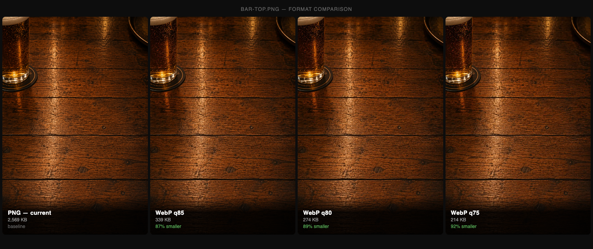

# Asset Pipeline

In dev, the frontend is vanilla ES modules loaded straight from the browser. No build step, no bundler, hot reload on save. In prod that's 39 requests for a page that should be 7.

I built this to play in bars and on planes, anywhere the wifi is fighting a crowd. First load is when people decide whether to bother. A crowded bar has one router and thirty people on it. Airplane wifi is metered and slow. The pipeline gets cold-load down to about 21 KB of JS+CSS+HTML on the wire. On a congested router, that's two seconds versus someone putting their phone away.

The pipeline runs during the Docker image build. It takes the source tree and produces a fully static `dist/` that nginx serves from disk. The final images carry no Node toolchain. Nothing touches assets at runtime.

---

## What it does

All of it runs in `scripts/build_assets.mjs`, in the Docker builder stage, before either service image assembles.

1. SVGs get comments stripped and whitespace collapsed, then a content hash baked into the filename (`logo-eae59c27.svg`). Other binary assets (WebP, woff2) are fingerprinted as-is. A manifest maps the original paths to the hashed ones so everything downstream can find them.

2. The 28 JS modules (27 in the runtime import graph — `types.js` is JSDoc-only) get bundled into a single file with esbuild. `minify: true` handles identifier mangling, syntax compression, and whitespace removal, including collapsing the newlines in HTML template strings that esbuild normally leaves alone. Asset references get rewritten, then the whole thing gets content-hashed.

3. The 10 CSS files get concatenated and run through esbuild's CSS transformer. Non-critical styles (everything except `critical.css`) merge into a single `app.css`. Both get content-hashed.

4. `index.html` gets rewritten: the 9 non-critical `<link>` tags collapse to one, the modulepreload graph (27 entries) drops, every URL swaps to its hashed equivalent, and the HTML gets stripped of comments and collapsed to a single line.

5. Every text asset (JS, CSS, HTML, SVG) gets a `.gz` sibling at level 9 compression. nginx's `gzip_static` serves the pre-compressed file directly. No CPU cost per request.

6. The output splits across two images. nginx gets `dist/static/` with all the hashed assets. The Python app gets `dist/index.html`, the one document it ever serves. Neither carries the Node toolchain.

---

## Before and after

Numbers from a Playwright session: first load on dev (localhost, no cache) and first load on prod (Cloudflare tunnel, no cache).

### Requests

```
Dev  ████████████████████████████████████████  39 requests
Prod ███████                                    7 requests
```

| Type    | Dev                    | Prod         |
|---------|------------------------|--------------|
| HTML    | 1 (unminified)         | 1 (minified) |
| CSS     | 10 individual files    | 2 bundles    |
| JS      | 24 individual modules  | 1 bundle     |
| Font    | 1                      | 1            |
| Images  | 3                      | 3            |
| **Total** | **39**               | **7**        |

### Transfer size

```
Dev  ████████████████████████████████████████████████████████████  ~358 KB
Prod ████████████████                                              ~237 KB
```

| Asset       | Dev         | Prod              | Ratio |
|-------------|-------------|-------------------|-------|
| JS          | 76.4 KB     | 12.5 KB (gzipped) | 6x    |
| CSS         | 49.9 KB     | 7.9 KB (gzipped)  | 6x    |
| HTML        | 6.1 KB      | 0.6 KB (gzipped)  | 10x   |
| SVGs        | ~12.1 KB    | 2.3 KB (gzipped)  | 5x    |
| bar-top     | 214 KB      | 214 KB (WebP)     | 1x    |
| **Total**   | **~358 KB** | **~237 KB**       | **1.5x** |

The bar-top row is 1x because both dev and prod now use the same WebP source file. Converting from PNG (2.5 MB) to WebP was a one-time source change, not something the pipeline does. The multiplier shows up in the JS/CSS/HTML rows.

Dev's JS transfer (76.4 KB) is larger than its decoded size (69.3 KB). The Performance API includes HTTP response headers in `transferSize`, so 24 separate module requests adds a few KB of overhead before a single byte of application code moves.

### Cache behavior

On repeat loads, prod assets serve from disk cache in 0ms. Content-hashed filenames plus `Cache-Control: immutable` mean the browser never rechecks them. Change any source file and the hash changes; the old version stays cached forever, which is fine because nothing will ever request it again.

Dev uses `?v=<hash>` appended to every URL at server startup. It works, but busting it requires a restart.

---

## Background image

The bar-top photo shipped as a 2.5 MB PNG. PNG is lossless, fine for vectors and text but wrong for a photograph. For camera images it's essentially uncompressed.

I ran a comparison across four quality levels. All of them look identical at mobile size. That's the only size that matters.

```
PNG  ████████████████████████████████████████████████████████  2,508 KB
q85  ███████                                                     331 KB
q80  ██████                                                      268 KB
q75  █████                                                       214 KB
```

<p align="center"></p>

I converted it once at the source level:

```bash
cwebp -q 75 static/images/bar-top.png -o static/images/bar-top.webp
```

The PNG is no longer in the repo. The pipeline fingerprints and serves `bar-top.webp` like any other binary asset. It doesn't get a `.gz` sibling. WebP is already a compressed format and gzipping it saves nothing.

The CSS and preload hint in `index.html` both reference `bar-top.webp`. The preload includes `type="image/webp"` so the browser knows what it's fetching before it parses the stylesheet.

---

## Where to find things

- Build script: `scripts/build_assets.mjs`
- Dockerfile stages: `assets` (builder), `nginx` (static files), `web` (app + index.html)
- nginx config: `ops/nginx.conf` (`gzip_static on`, `expires max`, `add_header Cache-Control immutable`)
- Compose: `docker-compose.prod.yml` targets the `nginx` stage via `target: nginx`

To rebuild after changing any source asset:

```bash
docker compose -f docker-compose.prod.yml --env-file .env.prod up -d --build nginx web
```
