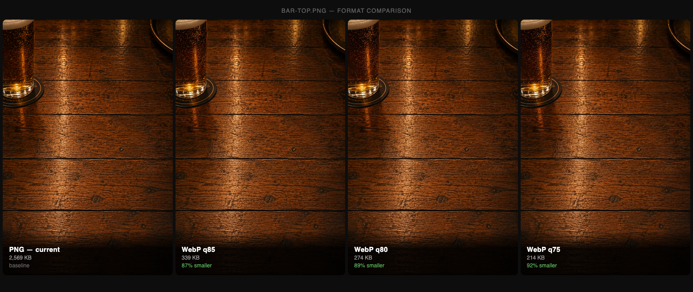

# Asset Pipeline

In dev, the frontend is vanilla ES modules loaded straight from the browser. No build step, no bundler, hot reload on save. In prod that's ~60 requests for a page that ships as 12.

I built this to play in bars and on planes, anywhere the wifi is fighting a crowd. First load is when people decide whether to bother. A crowded bar has one router and thirty people on it. Airplane wifi is metered and slow. The pipeline gets cold-load down to about 47 KB of gzipped JS+CSS+HTML on the wire (from ~347 KB unbundled). On a congested router, that's the difference between a couple of seconds and someone putting their phone away.

The pipeline runs during the Docker image build. It takes the source tree and produces a fully static `dist/` that nginx serves from disk. The final images carry no Node toolchain. Nothing touches assets at runtime.

---

## What it does

All of it runs in `scripts/build_assets.mjs`, in the Docker builder stage, before either service image assembles.

1. SVGs get comments stripped and whitespace collapsed, then a content hash baked into the filename (`logo-eae59c27.svg`). Other binary assets — WebP, woff2, and the `static/video/*` intro/background clips (h264 + hevc `.mp4` plus their `.webp` posters) — are fingerprinted as-is. A manifest maps the original paths to the hashed ones so everything downstream can find them.

2. The 38 JS modules (37 in the runtime import graph — `types.js` is JSDoc-only) get bundled into a single file with esbuild. `minify: true` handles identifier mangling, syntax compression, and whitespace removal, including collapsing the newlines in HTML template strings that esbuild normally leaves alone. Asset references get rewritten, then the whole thing gets content-hashed.

3. The 14 CSS files get concatenated and run through esbuild's CSS transformer. Non-critical styles (everything except `critical.css`) merge into a single `app.css`. Both get content-hashed.

4. `index.html` gets rewritten: the 13 non-critical `<link>` tags collapse to one, the modulepreload graph (37 entries) drops, every URL swaps to its hashed equivalent, and the HTML gets stripped of comments and collapsed to a single line. The web-app manifest is fingerprinted the same pass (`manifest.webmanifest`, step 4b): its icon refs are rewritten to hashed paths and its `<link rel="manifest">` href updated to match.

5. Every text asset (JS, CSS, HTML, SVG, webmanifest) gets a `.gz` sibling at level 9 compression. nginx's `gzip_static` serves the pre-compressed file directly. No CPU cost per request.

6. The output splits across two images. nginx gets `dist/static/` with all the hashed assets. The Python app gets `dist/index.html`, the one document it ever serves. Neither carries the Node toolchain.

---

## Before and after

Numbers from a Playwright resource-timing session (cache disabled): first load on dev (the live `:8888` app) and first load on prod (the built `dist/` served with `gzip_static` — the exact bytes nginx puts on the wire).

### Requests

```
Dev  ████████████████████████████████████████████████████████████  60 requests
Prod ████████████                                                  12 requests
```

| Type                       | Dev                   | Prod         |
|----------------------------|-----------------------|--------------|
| HTML                       | 1 (unminified)        | 1 (minified) |
| CSS                        | 14 individual files   | 2 bundles    |
| JS                         | 37 individual modules | 1 bundle     |
| Font                       | 1                     | 1            |
| SVG                        | 3                     | 3            |
| Image (webp posters)       | 2                     | 2            |
| Video (mp4, range-streamed)| 2                     | 2            |
| **Total**                  | **60**                | **12**       |

### Transfer size

Bundle assets only — JS, CSS, HTML, SVG, font, and the webp poster images. The two background videos are excluded (see below).

```
Dev  ████████████████████████████████████████████████████████████  ~638 KB
Prod ███████████████████████████████                               ~334 KB
```

| Asset            | Dev       | Prod              | Ratio |
|------------------|-----------|-------------------|-------|
| JS               | 213 KB    | 30 KB (gzipped)   | 7.2x  |
| CSS              | 120 KB    | 15 KB (gzipped)   | 7.9x  |
| HTML             | 14 KB     | 2 KB (gzipped)    | 6.9x  |
| SVG              | 6.4 KB    | 2.3 KB (gzipped)  | 2.8x  |
| Font (woff2)     | 47.6 KB   | 47.6 KB           | 1x    |
| Posters (webp)   | 237 KB    | 237 KB            | 1x    |
| **Total**        | **~638 KB** | **~334 KB**     | **1.9x** |

The JS/CSS/HTML rows are where the pipeline earns its keep: 37 modules collapse to one gzipped bundle and 14 stylesheets to two, taking JS+CSS+HTML on the wire from ~347 KB unbundled to ~47 KB. Font and posters are already-compressed formats, so the pipeline only fingerprints them — they pass through 1x, and now dominate what's left.

The two background clips (`landing-h264.mp4`, `game-start-h264.mp4`) are fingerprinted but not bundled, and nginx serves them via HTTP range requests — a first load pulls only the opening chunk, not the whole file — so a single "transfer size" number for them is misleading and they're left out of the table. Their webp posters (which *do* paint immediately) are the "Posters" row.

Dev's transfer numbers are larger than the decoded bytes because the Performance API counts HTTP response headers in `transferSize`; 37 separate module requests add real per-request overhead before a byte of application code moves — part of what bundling to one request removes.

### Cache behavior

On repeat loads, prod assets serve from disk cache in 0ms. Content-hashed filenames plus `Cache-Control: immutable` mean the browser never rechecks them. Change any source file and the hash changes; the old version stays cached forever, which is fine because nothing will ever request it again.

Dev appends `?v=<hash>` to every URL at server startup, and the app shell plus every dev-served `/static` response now carries `Cache-Control: no-cache` (`server/security.py`, `main.py`), so the browser revalidates rather than trusting a stale copy. That matters for an installed PWA: a cached HTML shell pointing at old hashed asset URLs can boot a version-skewed module graph and hang on the loading screen. Prod is unaffected — nginx serves the content-hashed `/static` bundles with their own far-future `immutable` cache, and this middleware never runs for them.

---

## Background media

The landing and game screens play a short muted video loop behind the UI (`bg-video` and `intro-video` in `index.html`), each with a WebP poster that paints instantly while the clip loads (`poster-landing.webp`, `poster-game.webp`). Two sources ship per clip — `*-hevc.mp4` (smaller, for devices that decode HEVC) with an `*-h264.mp4` fallback — and the pipeline fingerprints all four. Videos and posters get no `.gz` sibling: both are already-compressed formats, so gzip saves nothing. nginx serves the mp4s via HTTP range requests, so a first load streams only the opening chunk rather than the whole file.

The posters are WebP at quality 75. That number came from a comparison on the *old* static landing photo — a 2.5 MB PNG — where across four quality levels every one looked identical at mobile size (the only size that matters), so q75 won at ~214 KB:

```
PNG  ████████████████████████████████████████████████████████  2,508 KB
q85  ███████                                                     331 KB
q80  ██████                                                      268 KB
q75  █████                                                       214 KB
```

<p align="center"></p>

That original photo (`bar-top.webp`) is no longer used — the video loop replaced it — but the file still sits in `static/images/` and gets fingerprinted into `dist/`, so it's ~214 KB of dead weight worth pruning.

---

## Where to find things

- Build script: `scripts/build_assets.mjs`
- Dockerfile stages: `assets` (builder), `nginx` (static files), `web` (app + index.html)
- nginx config: `ops/nginx.conf` (`gzip_static on`, `expires max`, `add_header Cache-Control immutable`)
- Compose: `docker-compose.prod.yml` targets the `nginx` stage via `target: nginx`

To rebuild after changing any source asset:

```bash
docker compose -f docker-compose.prod.yml --env-file .env.prod up -d --build nginx web
```
