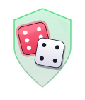
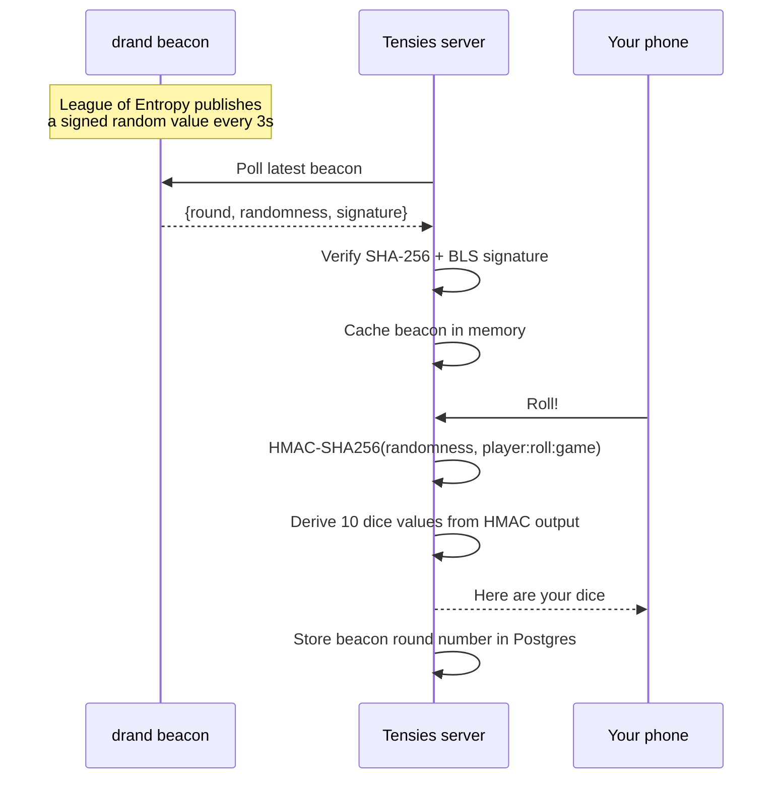
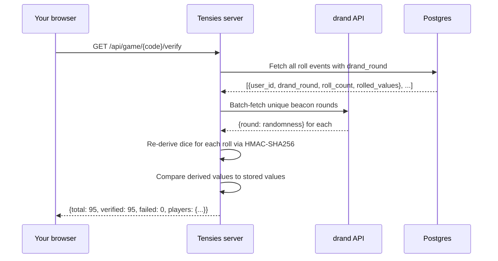

# Roll Trust

<p align="center">
  
</p>

Every roll in Tensies is backed by a public random beacon. Not because we think anyone is cheating at a bar dice game, but because it's cool that we can prove they aren't.

---

## Why this exists

When the server picks a number and says "trust me," you're trusting the server. Maybe the host's phone is running a rigged build. Maybe the server is biased. Probably not. But you can't prove it either way, and that's the whole problem with digital dice.

Roll Trust takes the randomness out of our hands. Every dice roll is derived from [drand](https://drand.love), a distributed random beacon run by a global network of independent organizations called the League of Entropy. The beacon publishes a fresh, cryptographically signed random value every three seconds. Nobody controls it. Not us, not the host, not any single node in the network.

After a game ends, the Roll Trust section on the game detail screen re-derives every roll from the public beacon data and confirms the dice landed exactly where the math says they should have. You can verify all of it yourself.

## The League of Entropy

[drand](https://drand.love) isn't run by one company. It's operated by the [League of Entropy](https://leagueofentropy.com), a consortium of independent organizations that collectively generate publicly verifiable randomness. Members include Cloudflare, Protocol Labs, the University of Chile, Kudelski Security, EPFL (the Swiss Federal Institute of Technology), and others spread across different countries and jurisdictions.

Every three seconds, these nodes run a distributed key generation protocol and produce a new beacon. No single member can predict or manipulate the output. You'd need to compromise a threshold of nodes across multiple organizations and continents simultaneously, which is a lot of effort to rig a bar dice game.

The beacon values are public. Anyone can fetch them from `api.drand.sh` and verify the BLS signatures against the chain's public key. The whole system is designed so that trust is distributed across the network instead of concentrated in any one place.

---

## How it works

The server polls the drand quicknet chain in the background and caches the latest beacon in memory. When you roll, the server uses that beacon's randomness to derive your dice values instead of calling `random.randint()`. The beacon round number gets stored alongside the roll event in Postgres so it can be looked up later.



### Derivation

Each roll produces a deterministic set of dice values from three inputs:

1. The beacon's 256-bit hex randomness value, used as the HMAC key
2. A roll identity string (`{player_id}:{roll_count}:{game_code}`), used as the HMAC message
3. HMAC-SHA256 output, split into 10 two-byte chunks, each mapped to a die face (1 through 6) via modular arithmetic

Same inputs, same dice. Different players, different roll counts, and different games all produce different HMAC messages, so they get different dice even when they share the same beacon round.

### Server-side beacon verification

When the beacon arrives, the server checks it before trusting it:

1. SHA-256 consistency: `randomness == SHA256(signature)`. Always checked.
2. BLS signature: pairing check against the chain's public key, confirming the beacon was actually produced by the League of Entropy. Checked when [blspy](https://github.com/Chia-Network/bls-signatures) is available, skipped gracefully if not.

If either check fails, the beacon is discarded and the roll falls back to local RNG. That roll won't be verifiable after the fact, but the game doesn't stall.

### Post-game verification

After a game ends, anyone can open `/games/{code}`. The Roll Trust section runs a batch verification:



The server pulls every roll event from Postgres, fetches the corresponding beacon randomness from the public drand API, re-derives the dice, and compares. The response includes per-player breakdowns showing how many rolls each person made and whether they all check out.

---

## Verify it yourself

You don't have to trust the verify endpoint either. Here's how to re-derive any roll from scratch using only public data.

### 1. Get the game data

```bash
curl https://your-server/api/game/HTVEC
```

Note the `players` array. Each player has a `user_id`.

### 2. Get the verification data

```bash
curl https://your-server/api/game/HTVEC/verify
```

Each player entry includes `total`, `verified`, and `failed` counts.

### 3. Fetch the beacon

Look up the beacon round from the public drand API:

```bash
curl https://api.drand.sh/52db9ba70e0cc0f6eaf7803dd07447a1f5477735fd3f661792ba94600c84e971/public/{round}
```

The `randomness` field is the 256-bit hex value used as the HMAC key.

### 4. Re-derive the dice

With the beacon randomness, player ID, roll count, and game code, you can re-derive the dice in any language. Here's Python:

```python
import hmac, hashlib

def derive_dice(randomness_hex, player_id, roll_count, game_code, num_dice=10):
    key = bytes.fromhex(randomness_hex)
    message = f"{player_id}:{roll_count}:{game_code}".encode()
    mac = hmac.new(key, message, hashlib.sha256).digest()
    return [
        (int.from_bytes(mac[i * 2 : (i * 2) + 2], "big") % 6) + 1
        for i in range(num_dice)
    ]
```

The output should match the `rolled_values` stored in the event. If it doesn't, something is wrong, and you have the cryptographic receipts to prove it.

### 5. Verify the beacon itself

If you want to go all the way, you can verify the beacon's BLS signature against the chain's public key. The drand docs cover this: [drand.love/docs/specification](https://drand.love/docs/specification/). The chain hash for quicknet is `52db9ba70e0cc0f6eaf7803dd07447a1f5477735fd3f661792ba94600c84e971`.

---

## Limitations

- Games played before the feature shipped have no beacon data. The Roll Trust section shows "No beacon data for this game" for those.
- When the beacon is unreachable (network blip, drand outage), rolls fall back to local RNG and aren't verifiable after the fact. The `no_beacon` count in the verify response tells you how many.
- Bias is 0.006% per die (4/65536 from two-byte mod 6). For a bar dice game, this is noise.
- Verification pulls from the Postgres telemetry event log. If `TELEMETRY_ENABLED=0`, rolls aren't recorded and can't be verified later.

---

## Full chain

Your dice come from HMAC-SHA256, keyed by a drand beacon, signed with BLS by the League of Entropy (Cloudflare, Protocol Labs, university research groups, and others). You can check every link yourself.

Nobody has to take anybody's word for it. That's the point.
