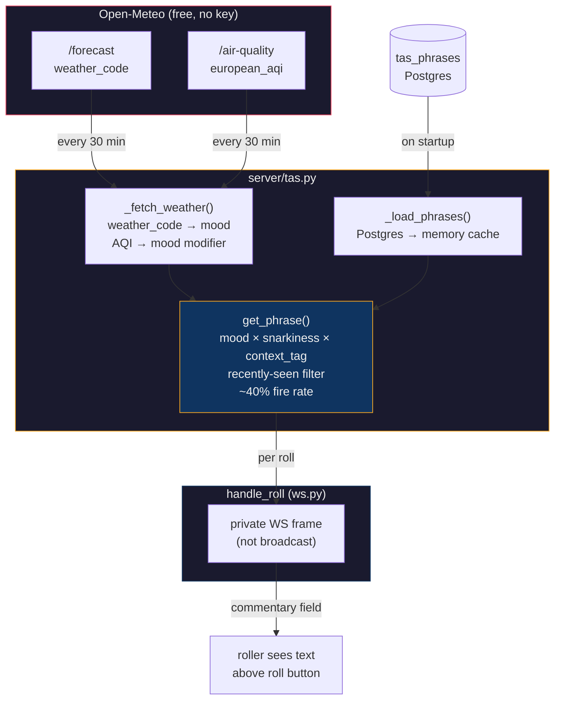

# Tensies Attitude System (TAS)

TAS is the game's personality. It watches you roll and has opinions about it. Heckling, cheering, passive-aggressively sighing, depending on its mood and how much attitude you've dialed in. The mood comes from the weather and air quality wherever the server lives. It never tells you why it's grumpy. It just is.

TAS is on by default but stays passive without location config. Mood sits at neutral, phrases still fire from the neutral pool. Set a lat/lon and it wakes up.

---

## Architecture



### How it plugs in

Same lifecycle pattern as drand and Discord: `start()` in the lifespan, `stop()` on shutdown, background poll task, sync public API on the hot path.

The roll handler calls `tas.get_phrase()` after `apply_roll()`. It's sync and does zero I/O, just a dict lookup and a `random.choice()`. The result rides on the private state frame sent to the roller before `delayed_broadcast`. Other players never see your commentary.

### Database tables

Two tables, one migration each:

| Table | Purpose | Read at runtime? |
|---|---|---|
| `tas_phrases` | The actual lines TAS delivers | Yes, loaded into memory on startup |
| `tas_personas` | Creative briefs describing each mood × snarkiness voice | No, reference material for generating phrases |

`tas_phrases` has a generic `phrase_type` column. The only type right now is `roll_heckle`. Future types (lobby taunts, win celebrations, idle nudges) just add rows with a new type. The code doesn't need to change.

### Phrase cache

Phrases load from Postgres into a nested dict on startup:

```
_phrases[phrase_type][snarkiness][mood][context_tag] → list[str]
```

The cache is rebuilt with `reload_phrases()` if you need a hot update. Otherwise it's set-and-forget.

---

## The mood system

Mood has two layers. Weather sets the base, air quality can push it darker.

### Layer 1: weather → base mood

The server polls Open-Meteo every 30 minutes (configurable). WMO weather codes map to moods:

| Weather | Code range | Mood | Vibe |
|---|---|---|---|
| Clear sky | 0-1 | `sunny` | Upbeat, warm, high-fives |
| Cloudy | 2-3 | `bored` | Flat affect, checked out |
| Fog | 45-48 | `mysterious` | Cryptic, ominous, fortune-teller energy |
| Light drizzle | 51-55 | `melancholic` | Wistful, poetic, dramatic sighs |
| Rain / freezing | 56-67 | `grumpy` | Short fuse, everything is annoying |
| Snow | 71-77 | `cozy` | Warm, snuggly, hot cocoa vibes |
| Rain showers | 80-82 | `chaotic` | Scattered, wild, unpredictable |
| Snow showers | 85-86 | `cozy` | Same as snow |
| Thunderstorm | 95-99 | `unhinged` | Zero filter, off the rails |
| Anything else | - | `neutral` | Baseline, no strong emotion |

### Layer 2: air quality modifier

The European AQI from the same Open-Meteo poll can shift the mood darker:

| AQI range | Effect |
|---|---|
| 0-40 (good/fair) | No change |
| 41-60 (moderate) | Edge shift (see below) |
| 61-80 (poor) | Override to `irritable` |
| 81+ (very poor) | Override to `suffocating` |

The edge-shift table for moderate air:

| Base mood | Shifts to |
|---|---|
| `sunny` | `restless` |
| `bored` | `irritable` |
| `melancholic` | `bitter` |
| `grumpy` | `irritable` |
| `cozy` | `stir_crazy` |
| `chaotic` | `manic` |
| `unhinged` | `manic` |
| `mysterious` | `paranoid` |
| `neutral` | `irritable` |

### Full mood list

There are 15 moods. Weather drives the common ones; the air-quality moods show up when conditions get rough.

| Mood | Source | Personality |
|---|---|---|
| `sunny` | weather | Bright, warm, genuinely cheerful |
| `bored` | weather | Going through the motions |
| `mysterious` | weather | Cryptic, reads tea leaves |
| `melancholic` | weather | Wistful, dramatic, poetic |
| `grumpy` | weather | Short fuse, complaining |
| `cozy` | weather | Snug, encouraging, blanket energy |
| `chaotic` | weather | Scattered, wild, unpredictable |
| `unhinged` | weather | Full send, no filter |
| `restless` | air shift | Jittery, antsy, cannot sit still |
| `bitter` | air shift | Resentful, backhanded everything |
| `stir_crazy` | air shift | Trapped energy, bouncing off walls |
| `manic` | air shift | Frenetic, too much, will not stop |
| `paranoid` | air shift | Suspicious, reading into everything |
| `irritable` | air override | Snappy, everything is a slight |
| `suffocating` | air override | Dramatically exhausted, gasping |
| `neutral` | fallback | Dry, matter-of-fact |

The mood never reveals its source. A `suffocating` TAS does not mention air quality. It just acts exhausted. A `cozy` TAS does not mention snow. It is just warm and encouraging.

---

## Snarkiness levels

Snarkiness is a global server setting, one knob for the whole instance. It controls how the mood is expressed, not what the mood is.

| Level | Tone |
|---|---|
| `friendly_drunk` | Warm, goofy, encouraging-ish. Slurs slightly. Your biggest fan with a flask. |
| `loud_obnoxious` | ALL CAPS energy. Sports-announcer at a house party. Cannot contain themselves. |
| `angry_mean` | Cutting, dismissive. Damns with faint acknowledgment. Clinical disdain. |
| `insufferable` | Condescending, passive-aggressive. Treats you like a science experiment. |

Default is `friendly_drunk`.

---

## Context tags

When TAS fires on a roll, it picks a context tag based on the outcome:

| Tag | Condition | What it means |
|---|---|---|
| `first_roll` | `roll_count == 1` | Opening roll of the round |
| `hot_streak` | `newly_locked >= 3` | Locked three or more dice in one roll |
| `whiff` | `newly_locked == 0`, `roll_count > 1` | Rolled and matched nothing (not first roll) |
| `close` | `matched >= 8` | Eight or more dice locked, almost done |
| `win` | `matched == 10` | All dice locked, but TAS skips this (the winner overlay handles it) |
| `default` | Everything else | A regular mid-game roll |

### Phrase selection

TAS builds a merged candidate pool from mood-specific and neutral phrases, so even moods with sparse coverage have variety:

1. Exact mood + exact context tag
2. Exact mood + `default` tag
3. `neutral` mood + exact context tag
4. `neutral` mood + `default` tag

All four pools are concatenated. A `random.choice()` picks from the combined list. Per-player recently-seen tracking (last 20 phrases) filters out repeats until the pool runs out, then resets.

Commentary fires on roughly 40% of non-winning rolls. The rest are silent.

---

## Personas

The `tas_personas` table stores a 3-5 sentence creative brief for each mood × snarkiness combination (60 total). These are not read at runtime. They exist so anyone generating or iterating on phrases has enough context to stay in voice.

Example persona (`grumpy` × `insufferable`):

> Passive-aggressive disappointment incarnate. Speaks in complete, grammatically perfect sentences that feel like a slap. Feigns concern. Uses "Oh" and "Well" as weapons. Compliments that are insults. Never raises voice. The quiet is the point.

To read all personas:

```sql
SELECT mood, snarkiness, persona FROM tas_personas ORDER BY mood, snarkiness;
```

---

## Variable placeholders

Phrases support these placeholders, filled at render time:

| Placeholder | Value |
|---|---|
| `{name}` | Player name |
| `{matched}` | Number of matched dice (0-10) |
| `{roll_count}` | How many rolls this round so far |
| `{target}` | The target number this round (1-6) |

Unknown keys are left as-is rather than crashing, so future phrase types can define their own placeholders without touching the formatter.

---

## Configuration

| Env var | Default | What it does |
|---|---|---|
| `TAS_ENABLED` | `1` | Master switch. `0` disables everything. |
| `TAS_LAT` | _(unset)_ | Server latitude for weather. Without this, mood stays `neutral`. |
| `TAS_LON` | _(unset)_ | Server longitude for weather. |
| `TAS_SNARKINESS` | `friendly_drunk` | One of: `friendly_drunk`, `loud_obnoxious`, `angry_mean`, `insufferable`. |
| `TAS_WEATHER_INTERVAL` | `1800` | Seconds between weather polls (default 30 min). |

All are forwarded through `docker-compose.yml`. Example `.env`:

```bash
TAS_LAT=33.20
TAS_LON=-96.63
TAS_SNARKINESS=angry_mean
```

### Verifying it works

Check the startup logs:

```
tas      loaded 731 phrases
tas      started  lat=33.20 lon=-96.63 snarkiness=angry_mean interval=1800.0s
tas      mood changed  neutral → bored
```

The `mood changed` line fires on the first successful weather fetch and whenever the mood shifts after that.

---

## Client display

Commentary floats above the roll button with a dark radial glow behind it. Fades in over 0.25s, holds for 3 seconds, fades out over 0.5s. Clicking Roll clears any visible commentary immediately.

The element is absolutely positioned on `.game-screen` so it does not affect the dice zone layout. The roll button area sits above it in z-index, so the glow bleeds under the dome, not over it.

---

## Code layout

| File | Role |
|---|---|
| `server/tas.py` | The whole backend: weather poller, phrase cache, mood mapping, `get_phrase()` |
| `server/config.py` | TAS config constants (`TAS_ENABLED`, `TAS_LAT`, etc.) |
| `main.py` | Lifespan wiring: `tas.start()` / `tas.stop()` |
| `server/ws.py` | Integration in `handle_roll`: context tag derivation, 40% gate, `get_phrase()` call |
| `migrations/008_tas.sql` | Schema: `tas_personas` + `tas_phrases` tables |
| `migrations/009_tas_seed_personas.sql` | 60 persona creative briefs |
| `migrations/010_tas_seed_roll_heckle.sql` | Initial roll_heckle phrases |
| `migrations/011_tas_more_roll_heckle.sql` | Expanded roll_heckle phrases |
| `static/js/commentary.js` | `showCommentary()` / `hideCommentary()` |
| `static/js/animations.js` | Calls `showCommentary` after dice reveal |
| `static/js/roll.js` | Calls `hideCommentary` on roll start |
| `static/js/game-render.js` | Creates the commentary DOM element on the game screen |
| `static/css/game.css` | `.tas-commentary` styles: positioning, glow, fade transitions |

---

## Adding phrases

Add rows to `tas_phrases` via a migration or direct insert:

```sql
INSERT INTO tas_phrases (phrase_type, mood, snarkiness, context_tag, phrase)
VALUES ('roll_heckle', 'grumpy', 'angry_mean', 'whiff', 'That was embarrassing, {name}.');
```

Restart the server (or call `tas.reload_phrases()` from a shell) to pick them up.

To check coverage:

```sql
SELECT mood, snarkiness, context_tag, count(*)
FROM tas_phrases
WHERE phrase_type = 'roll_heckle' AND active
GROUP BY 1, 2, 3
ORDER BY 1, 2, 3;
```

### Adding a new phrase type

Future TAS features (lobby taunts, idle nudges, whatever) need three things:

1. Insert rows with a new `phrase_type` value
2. Call `tas.get_phrase("your_type", context_tag, vars)` from the relevant handler
3. Display the result however makes sense on the client

The schema and cache handle the rest.

---

## Extending the mood system

To add a new mood:

1. Add a mapping in `_WEATHER_MOOD` or `_AQI_EDGE_SHIFT` in `server/tas.py`
2. Add a persona row for each snarkiness level in `tas_personas`
3. Add phrases for the new mood in `tas_phrases`
4. The fallback chain means you can start sparse, neutral phrases cover gaps

To add a new snarkiness level:

1. Add persona rows for every mood × the new level
2. Add phrases
3. Set `TAS_SNARKINESS` to the new value
