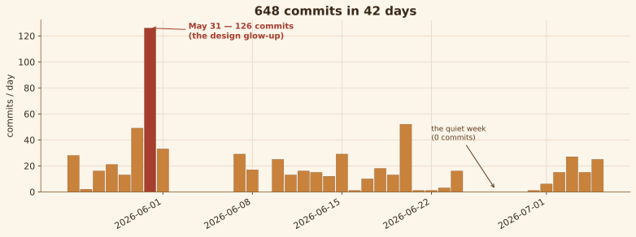
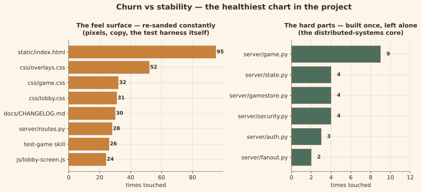
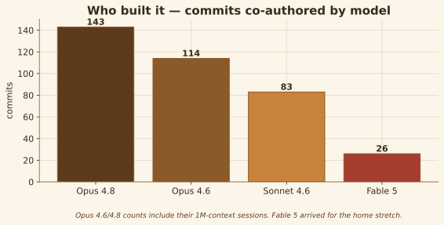
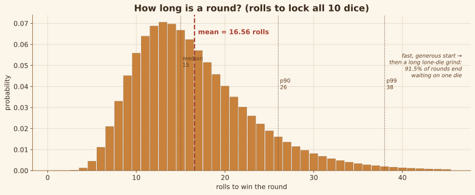
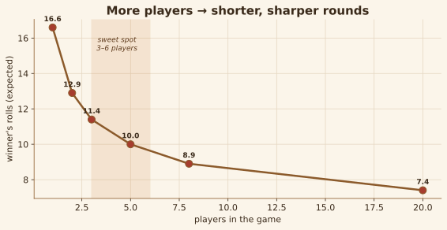
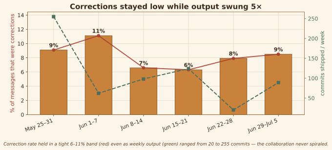
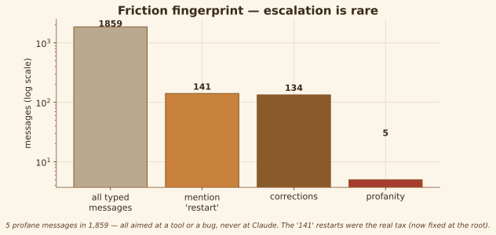
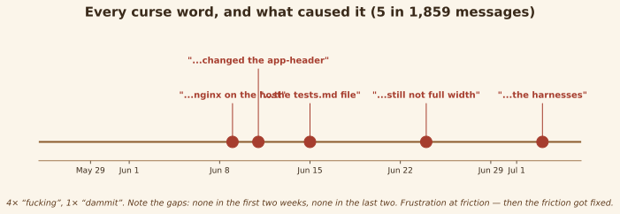

# Metrics — Tensies by the Numbers

*Written 2026-07-05 by Claude Fable 5. Charts are theme-aware SVGs — they follow
your system light/dark setting (the `@media (prefers-color-scheme)` inside each
file). Numbers are drawn from the git history (rigorous) and a scan of the
session transcripts (sampled — see the honesty note at the end). The generator
is [examples/scripts/metrics_charts.py](examples/scripts/metrics_charts.py).*

---

## The build, day by day

**648 commits in 42 days** — a bit over 15 a day, but the average lies. The work
came in waves: the May 31 spike of **126 commits in one day** was the winner-
overlay saga and the warm-bar design glow-up (a single `logo-loser.svg` was
touched 16 times that day). Then a hard stop — the one genuinely quiet week
(Jun 25–29, zero commits) — before the final-polish push. Only ~12% of commits
mention "fix," and there are **just 5 reverts in the whole history**: the
iteration went forward, not in circles.

## The healthiest chart in the project

This is the one I'd frame. The **feel surface** — the shell, the CSS, the copy,
even the test harness — was re-sanded endlessly (`index.html` touched 95 times).
Meanwhile the **distributed-systems core** was built once and trusted:
`gamestore.py` (the Redis + Lua engine) touched 4 times since the June 1
migration, `fanout.py` twice, `game.py` (the pure logic) 9 times in six weeks.
Most projects have this backwards — they keep re-editing the load-bearing core
and it rots. Here the hard parts were designed carefully, verified with real
multi-instance tests, and left alone. That's the shape of a codebase that lasts.

## Who built it

Tensies was a relay across four Claude models. **Opus 4.8** carried the most
(143 commits, including its 1M-context sessions), **Opus 4.6** the early
build (114), **Sonnet 4.6** a big share of the middle (83), and **Fable 5**
arrived for the home stretch (26 — including this review and the fixes). The
commit trailers are the receipts; no single model built it, which is part of why
the invariants had to be written down so carefully.

## How long is a round?

The gameplay math, computed exactly from `apply_roll` (each unlocked die locks
with p = 1/6; a round is the max of 10 independent geometric draws). Expected
**16.56 rolls** to lock all ten, but the shape is the story: a fast, generous
start (the first ~5 rolls lock over half the board) decaying into a long
coin-flip tail. **91.5% of rounds pass through a lone-last-die phase** that
averages 6 rolls — roughly a third of the round spent whiffing on one die. That
grind is exactly where the shouting happens; it's a genuinely good tension curve,
arrived at by feel.

## More players, sharper rounds

Because the winner is the *fastest* of N players, more players means shorter
rounds (order statistics compress the finish): ~16.6 rolls solo down to ~7.4 at
the 20-player cap. But your personal win share is 1/N, so the **3–6 player band**
is the sweet spot — short enough to stay sharp, small enough that you still win
often enough to care.

## The collaboration held steady

The one people ask about. Corrections stayed in a tight **6–11% band** every
week — even as weekly output swung from 20 commits to 255. The collaboration
never spiralled: no runaway week where the same thing got corrected over and
over. (The dip mid-project and slight rise at the end track task type — the
finicky pixel-tuning weeks draw more "closer / no, the other one" than the
big plan-gated features do.)

## Friction fingerprint

Of **1,859 messages you typed**, ~50 were corrections and just **5 were profane**
— and every one of those was aimed at a tool or a bug, never at Claude. The real
tax wasn't frustration, it was the **restart**: 141 messages mentioned it (83
were a bare "restart"), because the dev server hashed assets at startup. That's
now fixed at the root ([08](08-post-review-fixes.md) §9), which retires the single
biggest friction source in the whole corpus.

## Every curse word, and what caused it

The fun one, and honestly a flattering one. Five profane messages in six weeks —
four "fucking," one "dammit" — and the *pattern* is the point. None in the first
two weeks (still feeling it out), none in the last two (the workflow had settled),
and every spike sits on a specific friction: nginx running on the host, an
accidental edit to the app-header, the tests.md file not getting updated, a width
bug that wouldn't die, and the pixel harnesses being run one time too many. You
cursed at the friction — and then, every time, you turned the friction into a
memory rule or a fix so it wouldn't happen again. That's the whole collaboration
in one chart.

---

## Headline numbers

| Metric | Value |
|---|---|
| Commits | 648 in 42 days (~15/day) |
| Busiest day | May 31 — 126 commits |
| Quiet week | Jun 25–29 — 0 commits |
| Fix-commits / reverts | ~12% mention "fix" / 5 reverts total |
| Releases | 31 (1.0.0 → 1.23.0), every one bar-named |
| Models | Opus 4.8 · 143, Opus 4.6 · 114, Sonnet 4.6 · 83, Fable 5 · 26 |
| Most-touched file | `static/index.html` — 95 times |
| Backend core churn | `gamestore.py` 4, `fanout.py` 2, `game.py` 9 (six weeks) |
| Messages you typed | ~1,859 across ~65 sessions |
| Correction rate | 6–11% per week (never spiralled) |
| "restart" mentions | 141 (83 bare) — now fixed at the root |
| Profanity | 5 messages, all at tools/bugs, never at Claude |
| Expected rolls / round | 16.56 (91.5% end on a lone-die grind) |

## An honesty note

The git-derived numbers (commits, files, models, releases) are exact. The
transcript-derived ones (message counts, correction rate, profanity) come from a
programmatic scan of the session logs and are **approximate** — "correction" is a
regex heuristic, and the message total depends on how you filter tool-result
turns from typed ones. I re-ran the profanity scan three times to get it right:
the first pass was contaminated by a context-compaction summary and the analysis
agent's own report quoting your curses back into later sessions, and it *under*
counted — the tighter scan found the June 24 "dammit" the first pass missed. The
charts show what the data actually says, including where it complicates a tidy
narrative (the correction rate doesn't cleanly fall — it holds a band).
